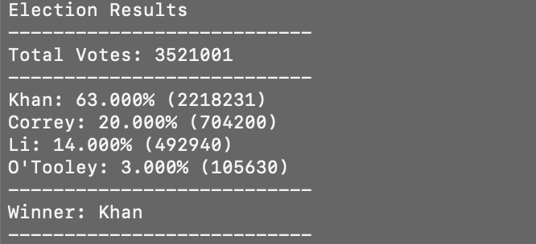

# python-challenge
 
Using CSV files of election and financial data, I computed profit and losses over the entire period of time in the files and then created a text file (located in the "analysis" folder) with the results. The financial results are:

For the elections file, I analyzed the people who voted to get the winning candidate. The results were also exported to a text file, and can be seen here as weel:

